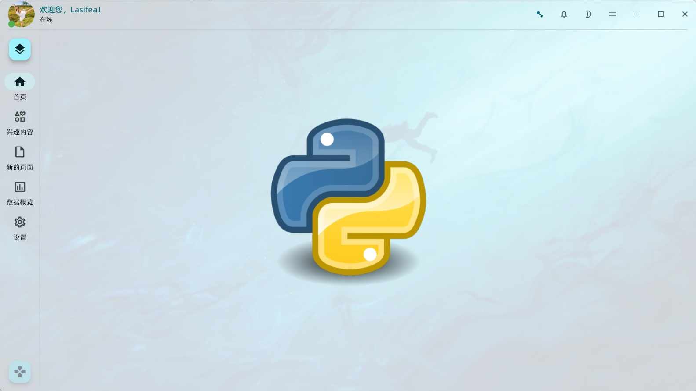
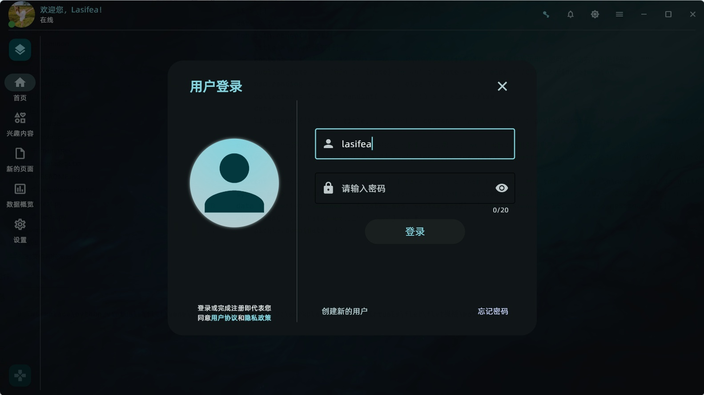
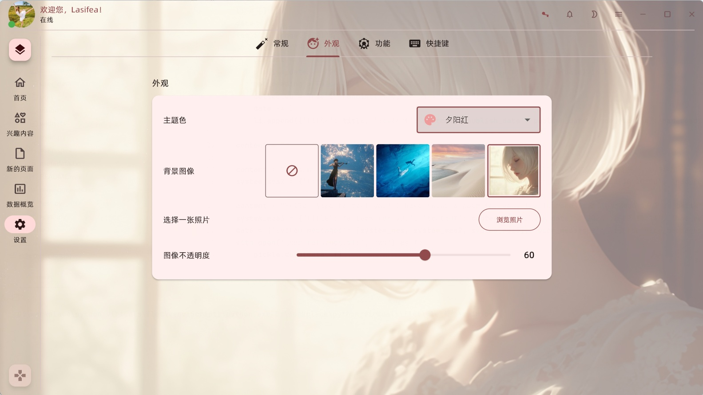
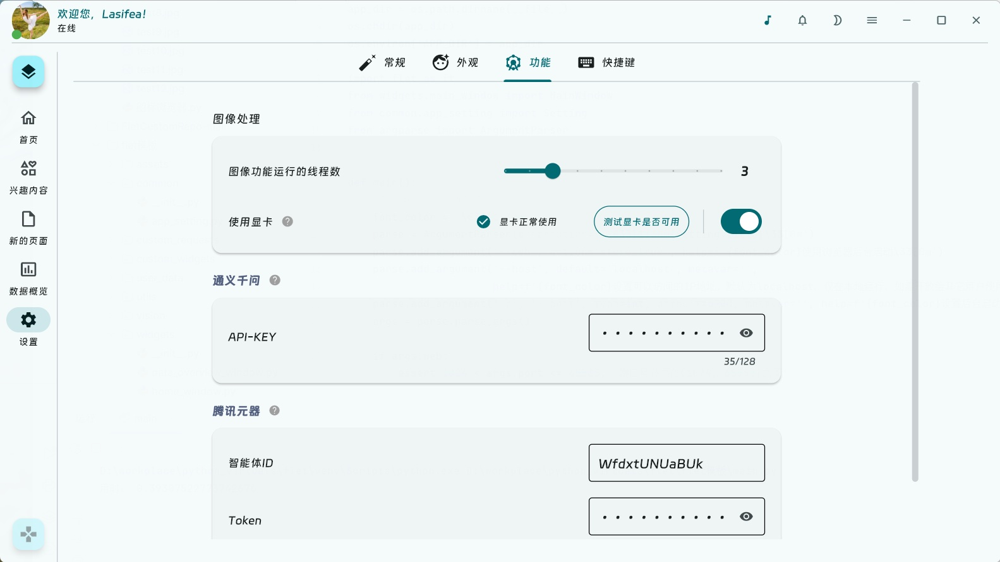

<h1 align="center"> Flet-GUI-basic</h1>

## ✨简介
本项目主要提供一个Flet GUI的基础模板结构，可自由组装或自定义部件，轻松创建出专属于自己的应用。支持多种颜色动态切换，尽可能少的依赖项，平台支持度：Windows > Web。

## 📢近期更新
- **`2024-12-10`** 发布软件**0.3.0**版本，增加**CatGPT功能**（支持通义千问及腾讯元器），增加**简易的音乐播放功能**，增加**使用显卡计算耗时的图像处理功能**，增加**登录及消息通知界面**，项目结构更细拆分，还有更多功能及界面改进，欢迎大家打开软件体验！
- **`2025-02-14`** 发布软件**0.4.0**版本，美化账号登录及部分界面，增加修改软件背景图的功能，优化部分组件的使用体验。
---

## 界面预览
|     |  |
|--------------------------------|--------------------------------|
|  |  |
|  |  |

## 💻下载安装
推荐使用[**Python>=3.8**](https://www.python.org/)，补丁版本越高越好。在终端输入以下指令按回车

```bash
pip install -r requirements.txt
```

## 🐍在Python中使用
项目启动文件为根目录中的main.py

打开终端，确保当前路径处于项目的根目录，输入以下指令按回车键启动。注意，在**Windows**系统中命令为python，在**Linux**系统中命令为python3
```bash
python main.py
```
如需以web端启动，打开终端，输入以下命令，默认地址127.0.0.1，默认端口5200
```bash
python main.py --web
```
查看web端启动的所有配置参数及帮助信息，输入以下命令
```bash
python main.py --help
```

## 🧩项目结构
```
Flet-GUI-basic/
├── assets/             # 静态资源文件
├── common/             # 项目经常用到的功能
│   └── app_setting.py      # 项目设置
├── custom_requests/    # 自定义的网络请求功能
├── custom_widgets/     # 自定义的通用小组件，方便与其它项目集成
├── user_data/          # 存储应用使用数据，可随时删除
├── utils/              # 辅助功能
├── widgets/            # 功能界面
│   └── main_window.py      # 项目主界面
│   └── main_window_widgets.py    # 主界面的组件，如标题栏、侧边栏、左右抽屉组件
│   └── home_window.py      # 首页界面
│   └── setting_window.py   # 设置界面
├── main.py             # 项目启动文件
├── requirements.txt    # 项目依赖环境
```

## 🔔使用需知
- 项目的界面切换方式为组件切换，增加界面可参考**home_window.py**或**setting_window.py**的格式，继承**Container**组件并增加自己的功能，同时在**main_window.py**文件中的**switch_windows**方法中添加界面切换条件。
- 原则上小组件的功能尽量在当前界面文件中实现，如当前界面中的按钮组件会修改其它界面的组件内容，则在上层界面实现功能，并在_bind方法中绑定相应功能。
---

## 📝代办清单
- 增加用户信息界面
- 增加表格数据操作界面
- 增加图像基本处理功能，如裁剪、修改尺寸、旋转
- 增加工业常用的图像功能，如图像分类、目标检测，支持导入自训练模型（也许）
- 音乐在线播放功能（也许）
- 视频在线播放功能（也许）
- 更多图像处理功能，如实例分割、人脸库对比、文字识别（也许）
- 。。。

## 😀作者有话说
- 软件基础界面目前大致符合作者预期，除bug修复外，预计一段时间不会再有界面更新。我将开源到GitHub上，希望能有志同道合的朋友一起完善。

## ❔常见问题
- **Q**：如何安装Python？<br>**A**：😑请自行搜索查找或参考Python官方教程安装，也许你不该来到此项目。
- **Q**：软件体积怎么这么大？居然要1个G！<br>**A**：😶部分图像功能所需的模型体积非常大，另外图像处理用到的opencv体积也大，如果除去该功能，软件总体积约150M，其中Flet包占用约100M。
- **Q**：我的电脑上有显卡，但提示显卡不可用。<br>**A**：👀该功能还处于测试阶段，理论上同时支持Nvidia、AMD、Intel显卡，甚至性能较好的集显也能使用，但作者硬件设备有限，目前仅在Nvidia显卡做过测试。如果出现非硬件的问题，还请邮箱联系我，注明您的显卡型号、操作系统及显卡驱动的版本。
- **Q**：我想在自己的项目中使用美颜及换脸的功能，能否提供源码？<br>**A**：❌我还没打算开源，目前不免费提供，如需购买请联系作者，软件中少部分的图像功能已在[**simple-vision-tasks**](https://github.com/lasifea/simple-vision-tasks)项目中开源。

## 🐵联系作者
`邮箱` lasifea@163.com

`微信` 添加时，请备注来意


